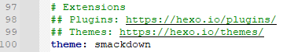
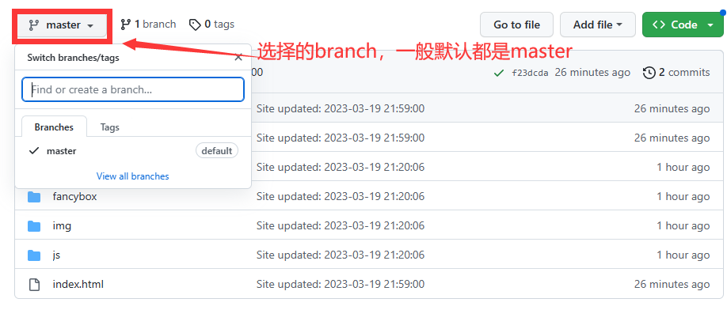
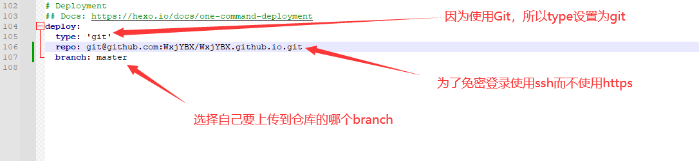
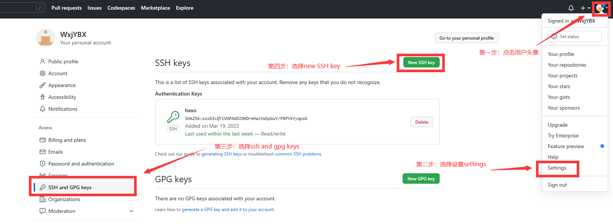
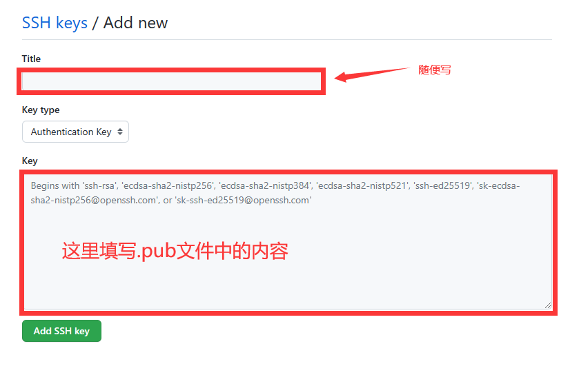
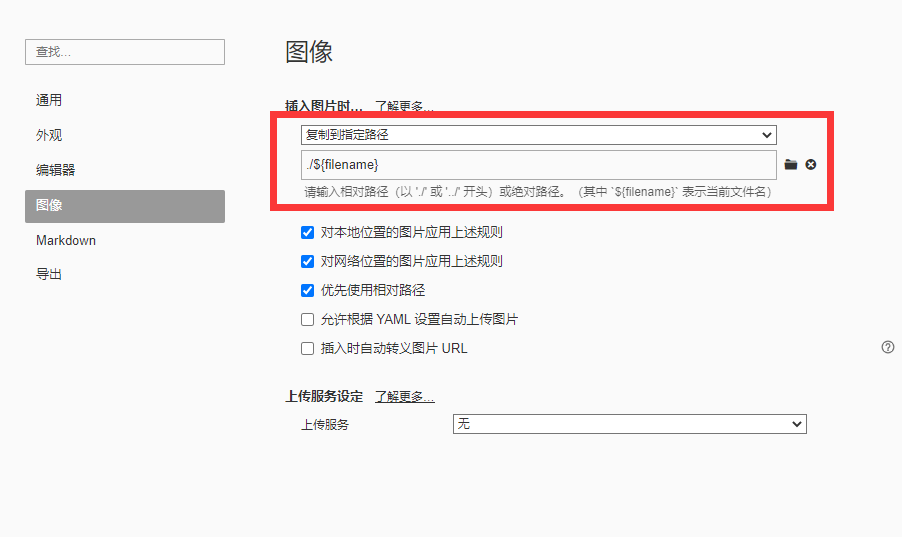
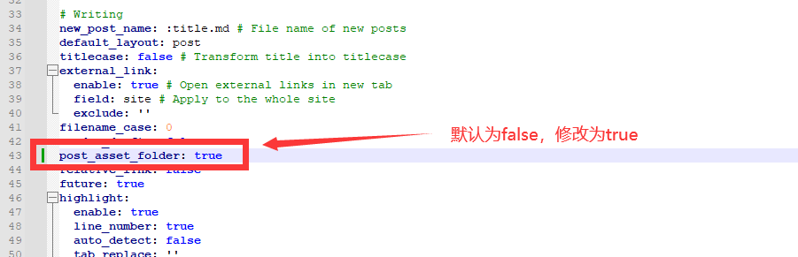

# hexo+git搭建个人博客(效果演示：WxjYBX.github.io)


# 1.前置准备

## 1.node.js

## 2.hexo

## 3.Git

## 4.环境变量的配置


# 2. 博客搭建

## 1. hexo本地使用

1. 网站环境初始化

   ```cmd
   // 初始化当前目录，在当前目录中生成网站所需要的基础文件
   hexo init
   
   // 命令执行完毕后在当前目录下生成的文件
   myblog
   	-- source  // 存放能够显示在网站上的博客文件
   		-- _posts
   			-- hello-world.md  // markdown语法文件
   	-- themes  // 存放hexo页面主题
   	-- _config.yml  // 配置hexo网站相关配置，如主题、插件等
   ```

2. 静态文件加载

   ```cmd
   // 生成能够放到git上的静态资源
   hexo g
   
   // 命令执行完毕后在当前文件夹下生成静态资源文件夹
   myblog
   	...
   	-- public // 存放网站静态资源
   ```

3. 启动网站

   ```cmd
   hexo s
   
   // 默认运行端口：localhost:4000
   ```

4. ***博客更新流程(一定要记住，每次只要想开启服务，就一定要执行这两步!)***

   ```cmd
   hexo clean  // 清空hexo缓存
   hexo g  // 生成静态资源
   ```

5. 网站主题

   1. 主题下载(点击对应主题进入github在项目介绍中寻找下载方式，一般是 git clone )：https://hexo.io/themes/

   2. 打开配置文件：_config.yml

   3. 找到文件100行内容为：theme: 主题名

   4. 将./themes中的主题 文件夹的名字 代替掉配置文件中的 theme:主题名 中的主题名

      ```notepad++
      // 例如 下载的主题的文件夹名为：smackdown
      theme: "主题名，如smackdown"
      ```

      

## 2. hexo远端部署

1. 下载git插件

   ```cmd
   // 部署插件
   npm install hexo-deployer-git --save
   ```

2. github远程仓库

   仓库命名规则：(自己的用户名).github.io

   例如：用户名为：WxjYBX，则仓库名为WxjYBX.github.io

3. 配置文件修改(_config.yml)

   找到配置文件第104行的内容

   ```notepoad++
   // 修改deploy相关属性
   type: 'git'
   repo: 这里面填写规定格式的地址，格式如下：git@github.com:(Github用户名)/(Github用名).github.io.git
   branch: 要放置在仓库的分支名(随意填写，如master)
   ```

   

4. 进行远端部署

   1. 本地 SSHKey创建

      1. 运行Git Bash

         1. 第一种方式(进入文件资源管理器的任意磁盘后，鼠标右击任意空白处，选择Git Bash Here)
         2. 第二种方式(点击电脑左下角开始键，找到Git Bash)

      2. 创建ssh key

         ```cmd
         // 首先输入这个命令
         cd ~/.ssh
         // 如果报错提示不存在 执行 mkdir ~/.ssh
         
         // rsa不要乱改 -b表示加密强度 -C表示邮箱
         ssh-keygen -t rsa -b 2048 -C 'github的注册邮箱，例如xxxx@qq.com'
         // 执行这一步会要求不断输入，默认全部直接回车就可以了
         
         //查看当前文件夹下的内容 
         ls
         // 如果上一步生成成功，应该会多出 id_rsa 以及 id_rsa.pub 两个文件
         
         // 复制id_rsa.pub文件里的 !全部! 内容，打开方式有两种，一种是进入电脑 C:\Users\Admin\.ssh 中打开.pub文件，另一种是继续在git bash中输入命令 vim id_rsa.pub 进入文件
         
         // 复制到的内容之后会用到
         ```

   2. Github SSHKey设置

      

      

   3. 测试

      ```cmd
      // 测试命令
      ssh -T git@github.com
      // 后面会有输入yes/no,选择yes，之后显示一大段文本，里面有successfully就算成功
      ```

5. 正式部署

   ```cmd
   // 正常来说会需要输入账密，但是我们设置了ssh登录就不用了
   hexo clean
   hexo g
   hexo d
   // 执行完后，出现Deploy done: git 就算成功
   ```

6. 在浏览器地址栏输入仓库名，例如：WxjYBX.github.io即可访问(正式文章结束)

7. 如果需要显示图片(只针对typora可用，不过都用markdown了，真的有人不用typora吗？)

   1. 下载图片插件

      ```cmd
      npm install hexo-asset-img --save
      ```

   2. 设置typora图片格式(选择左上角文件，选择偏好设置，选择图像)

      

   3. 修改配置文件(_config.yml)

      

   4. 重新上传到github即可

