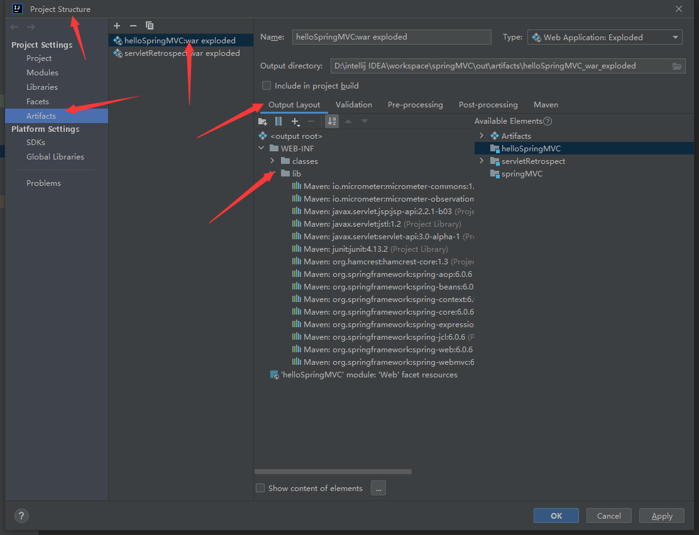

# SpringMVC

## 1. 回顾Servlet

### 1. Tomcat安装与配置环境变量

### 2. 案例

- HelloServlet.java

  ```java
  public class HelloServlet extends HttpServlet {
      @Override
      protected void doGet(HttpServletRequest req, HttpServletResponse resp) throws ServletException, IOException {
          // 1.获取前端参数
          String method = req.getParameter("method");
          if(method.equals("add")){
              req.getSession().setAttribute("msg", "执行了add");
          }
          if(method.equals("delete")){
              req.getSession().setAttribute("msg", "执行了delete");
          }
          // 2.调用业务层
          // 3.视图转发或者重定向
          req.getRequestDispatcher("/WEB-INF/jsp/test.jsp").forward(req, resp);
      }
  
      @Override
      protected void doPost(HttpServletRequest req, HttpServletResponse resp) throws ServletException, IOException {
          doGet(req, resp);
      }
  }
  ```

- 项目文件夹右击Add framework Support 勾选web Application，默认4.0

- 依赖添加(pom.xml)

  ```xml
  <dependencies>
      <dependency>
          <groupId>junit</groupId>
          <artifactId>junit</artifactId>
          <version>4.13.2</version>
      </dependency>
      <dependency>
          <groupId>org.springframework</groupId>
          <artifactId>spring-webmvc</artifactId>
          <version>6.0.6</version>
      </dependency>
      <dependency>
          <groupId>javax.servlet</groupId>
          <artifactId>servlet-api</artifactId>
          <version>3.0-alpha-1</version>
      </dependency>
      <dependency>
          <groupId>javax.servlet.jsp</groupId>
          <artifactId>jsp-api</artifactId>
          <version>2.2.1-b03</version>
      </dependency>
      <dependency>
          <groupId>javax.servlet</groupId>
          <artifactId>jstl</artifactId>
          <version>1.2</version>
      </dependency>
  </dependencies>
  ```

- web.xml

  ```xml
  <?xml version="1.0" encoding="UTF-8"?>
  <web-app xmlns="http://xmlns.jcp.org/xml/ns/javaee"
           xmlns:xsi="http://www.w3.org/2001/XMLSchema-instance"
           xsi:schemaLocation="http://xmlns.jcp.org/xml/ns/javaee http://xmlns.jcp.org/xml/ns/javaee/web-app_4_0.xsd"
           version="4.0">
  
      <servlet>
          <servlet-name>hello</servlet-name>
          <servlet-class>com.example.servlet.HelloServlet</servlet-class>
      </servlet>
      <servlet-mapping>
          <servlet-name>hello</servlet-name>
          <url-pattern>/hello</url-pattern>
      </servlet-mapping>
  </web-app>
  ```

- 配置Tomcat服务器

## 2. SpringMVC

### 1.1. 非注解开发项目环境配置

- 项目add framework support选择web application

- Tomcat配置当前项目

- project structure配置Artifacts中的项目(**新建lib目录文件夹，将项目依赖全部复制进来，不然之后会报错**)

  

**重点！！！**

**这一步一定要注意版本控制，仔细检查当前版本的包是否能够正常地为项目运行提供支持(当前使用jdk17)。**

**1. Tomcat10之后的javax.\*对应的包全都更名为jakarta.*，所以如果不改版本，就要修改所有的javax为jakarta(不如改版本方便)**

**2.1. springmvc的版本不要用6.0.6，同样的，jsp-api的版本不要用2.2.1-b03，servlet-api的版本不要用3.0-alpha-1，这样的配置会报错！！**

**2.2. springmvc的版本用5.1.19.RELEASE，同样的，jsp-api的版本用2.2，servlet-api的版本用2.5，这个版本可以跑通**

**3. 如果之前用过别的版本，记得在project structure中删除之后再重新导入新版本的包**

### 1.2. 非注解开发项目代码

- resources

  - springmvc-servlet.xml

    - ```xml
      <?xml version="1.0" encoding="UTF-8"?>
      <beans xmlns="http://www.springframework.org/schema/beans"
             xmlns:xsi="http://www.w3.org/2001/XMLSchema-instance"
             xsi:schemaLocation="http://www.springframework.org/schema/beans
              https://www.springframework.org/schema/beans/spring-beans.xsd">
      
      <!--    处理器映射器-->
          <bean class="org.springframework.web.servlet.handler.BeanNameUrlHandlerMapping" />
      <!--    处理器适配器-->
          <bean class="org.springframework.web.servlet.mvc.SimpleControllerHandlerAdapter" />
      <!--    视图解析器-->
          <bean class="org.springframework.web.servlet.view.InternalResourceViewResolver" id="internalResourceViewResolver" >
      <!--        前缀-->
              <property name="prefix" value="/WEB-INF/jsp/" />
      <!--        后缀-->
              <property name="suffix" value=".jsp" />
          </bean>
      
          <bean id="/hello" class="com.example.controller.HelloController" />
      
      </beans>
      ```

- controller

  - HelloController

    - ```java
      public class HelloController implements Controller {
          @Override
          public ModelAndView handleRequest(HttpServletRequest httpServletRequest, HttpServletResponse httpServletResponse) throws Exception {
              ModelAndView mv = new ModelAndView();
      
              // 业务代码
              String result = "HelloSpringMVC";
      
              mv.addObject("msg", result);
      
              // 试图跳转
              mv.setViewName("test");
      
              return mv;
          }
      }
      ```

- web->WEB-INF

  - web.xml

    - ```xml
      <?xml version="1.0" encoding="UTF-8"?>
      <web-app xmlns="http://xmlns.jcp.org/xml/ns/javaee"
               xmlns:xsi="http://www.w3.org/2001/XMLSchema-instance"
               xsi:schemaLocation="http://xmlns.jcp.org/xml/ns/javaee http://xmlns.jcp.org/xml/ns/javaee/web-app_4_0.xsd"
               version="4.0">
      
      <!--    配置DispatcherServlet:这是SpringMVC的核心：请求分发器，前端控制器-->
          <servlet>
              <servlet-name>springmvc</servlet-name>
              <servlet-class>org.springframework.web.servlet.DispatcherServlet</servlet-class>
      <!--        DispatcherServlet必须要绑定SpringMVC的配置文件，也就是Spring的配置文件-->
              <init-param>
                  <param-name>contextConfigLocation</param-name>
                  <param-value>classpath:springmvc-servlet.xml</param-value>
              </init-param>
      <!--        启动级别1-->
              <load-on-startup>1</load-on-startup>
          </servlet>
      
      <!--    在SpringMVC中 /与/*是有区别的-->
      <!--    /：匹配所有请求，不匹配.jsp文件-->
      <!--    /*：匹配所有的请求，包括.jsp页面-->
          <servlet-mapping>
              <servlet-name>springmvc</servlet-name>
              <url-pattern>/</url-pattern>
          </servlet-mapping>
      </web-app>
      ```

- 依赖

  - pom.xml

    - ```xml
      <dependencies>
          <dependency>
              <groupId>junit</groupId>
              <artifactId>junit</artifactId>
              <version>4.13.2</version>
          </dependency>
          <dependency>
              <groupId>org.springframework</groupId>
              <artifactId>spring-webmvc</artifactId>
              <version>5.1.19.RELEASE</version>
          </dependency>
          <dependency>
              <groupId>javax.servlet</groupId>
              <artifactId>servlet-api</artifactId>
              <version>2.5</version>
          </dependency>
          <dependency>
              <groupId>javax.servlet.jsp</groupId>
              <artifactId>jsp-api</artifactId>
              <version>2.2</version>
          </dependency>
          <dependency>
              <groupId>javax.servlet</groupId>
              <artifactId>jstl</artifactId>
              <version>1.2</version>
          </dependency>
      </dependencies>
      ```

### 2.1. 注解开发SpringMVC环境配置

**配置环境不能和之前一样，要重新配置，因为需要的版本又发生了变化(当前使用jdk17)**

**springmvc的版本用5.3.26（别用6，6版本太高了），同样的，jsp-api的版本用2.2，servlet-api的版本用2.5，这个版本可以跑通**

### 2.2. 注解开发代码

- Controller

  - HelloController

    - ```java
      @Controller
      public class HelloController {
      
          @RequestMapping("/hello")
          public String hello(Model model){
              model.addAttribute("msg", "hello,annotationSpringMVC!");
              return "hello";// 会被视图解析器处理
          }
      }
      ```

- resources

  - springmvc-servlet.xml

    - ```xml
      <?xml version="1.0" encoding="UTF-8"?>
      <beans xmlns="http://www.springframework.org/schema/beans"
             xmlns:xsi="http://www.w3.org/2001/XMLSchema-instance"
             xmlns:context="http://www.springframework.org/schema/context"
             xmlns:mvc="http://www.springframework.org/schema/mvc"
             xsi:schemaLocation="http://www.springframework.org/schema/beans
              https://www.springframework.org/schema/beans/spring-beans.xsd
              http://www.springframework.org/schema/context
              https://www.springframework.org/schema/context/spring-context.xsd
              http://www.springframework.org/schema/mvc
              https://www.springframework.org/schema/mvc/spring-mvc.xsd">
      
          <!--    自动扫描包，让指定目录下的注解生效，由IOC容器统一管理-->
          <context:component-scan base-package="com.example.controller"/>
          <!--    让springMVC不处理静态资源-->
          <mvc:default-servlet-handler />
          <!--    支持MVC注解驱动-->
          <!--    在Spring中一般采用@RequestMapping注解来完成映射关系-->
          <!--    只有在上下文中注册了-->
          <!--    DefaultAnnotationHandlerMapping（类级别处理） 以及 AnnotationMethodHandlerAdapter（方法级别处理）-->
          <!--    实例才能使@RequestMapping注解生效-->
          <!--    annotation-driven配置自动完成上述两个实例注入-->
      
          <mvc:annotation-driven />
          <!--    视图解析器-->
          <bean class="org.springframework.web.servlet.view.InternalResourceViewResolver" id="internalResourceViewResolver" >
              <!--        前缀-->
              <property name="prefix" value="/WEB-INF/jsp/" />
              <!--        后缀-->
              <property name="suffix" value=".jsp" />
          </bean>
      
      </beans>
      ```

- 其余同上


### 3. spring使用JSON

- 依赖注入

  - ```xml
    <dependencies>
        <!-- https://mvnrepository.com/artifact/com.fasterxml.jackson.core/jackson-databind -->
        <dependency>
            <groupId>com.fasterxml.jackson.core</groupId>
            <artifactId>jackson-databind</artifactId>
            <version>2.14.2</version>
        </dependency>
        <dependency>
            <groupId>org.projectlombok</groupId>
            <artifactId>lombok</artifactId>
            <version>1.18.26</version>
        </dependency>
    </dependencies>
    ```

- resources

  - ```xml
    <?xml version="1.0" encoding="UTF-8"?>
    <beans xmlns="http://www.springframework.org/schema/beans"
           xmlns:xsi="http://www.w3.org/2001/XMLSchema-instance"
           xmlns:context="http://www.springframework.org/schema/context"
           xmlns:mvc="http://www.springframework.org/schema/mvc"
           xsi:schemaLocation="http://www.springframework.org/schema/beans
            https://www.springframework.org/schema/beans/spring-beans.xsd
            http://www.springframework.org/schema/context
            https://www.springframework.org/schema/context/spring-context.xsd
            http://www.springframework.org/schema/mvc
            https://www.springframework.org/schema/mvc/spring-mvc.xsd">
    
        <!--    自动扫描包，让指定目录下的注解生效，由IOC容器统一管理-->
        <context:component-scan base-package="com.example.controller"/>
        <!--    让springMVC不处理静态资源-->
        <mvc:default-servlet-handler />
        <!--    支持MVC注解驱动-->
        <!--    在Spring中一般采用@RequestMapping注解来完成映射关系-->
        <!--    只有在上下文中注册了-->
        <!--    DefaultAnnotationHandlerMapping（类级别处理） 以及 AnnotationMethodHandlerAdapter（方法级别处理）-->
        <!--    实例才能使@RequestMapping注解生效-->
        <!--    annotation-driven配置自动完成上述两个实例注入-->
    
    <!--    jackson乱码问题配置-->
        <mvc:annotation-driven>
            <mvc:message-converters register-defaults="true">
                <bean class="org.springframework.http.converter.StringHttpMessageConverter">
                    <constructor-arg value="UTF-8" />
                </bean>
                <bean class="org.springframework.http.converter.json.MappingJackson2HttpMessageConverter">
                    <property name="objectMapper" >
                        <bean class="org.springframework.http.converter.json.Jackson2ObjectMapperFactoryBean">
                            <property name="failOnEmptyBeans" value="false" />
                        </bean>
                    </property>
                </bean>
            </mvc:message-converters>
        </mvc:annotation-driven>
    
        <!--    视图解析器-->
        <bean class="org.springframework.web.servlet.view.InternalResourceViewResolver" id="internalResourceViewResolver" >
            <!--        前缀-->
            <property name="prefix" value="/WEB-INF/jsp/" />
            <!--        后缀-->
            <property name="suffix" value=".jsp" />
        </bean>
    
    </beans>
    ```

- controller

  - UserController

    - ```java
      package com.example.controller;
      
      import com.example.Utils.JsonUtils;
      import com.example.pojo.User;
      import com.fasterxml.jackson.core.JsonProcessingException;
      import com.fasterxml.jackson.databind.ObjectMapper;
      import com.fasterxml.jackson.databind.SerializationFeature;
      import org.springframework.stereotype.Controller;
      import org.springframework.web.bind.annotation.RequestMapping;
      import org.springframework.web.bind.annotation.ResponseBody;
      import org.springframework.web.bind.annotation.RestController;
      
      import java.text.SimpleDateFormat;
      import java.util.ArrayList;
      import java.util.Date;
      import java.util.List;
      
      //@Controller
      @RestController //函数经过视图解析器，直接返回字符串
      public class UserController {
      
          @RequestMapping("/j1")
      //    @ResponseBody 配合Controller使用 //函数不经过视图解析器，直接返回字符串
          public String json1() throws JsonProcessingException {
      
              // jackson ObjectMapper
              ObjectMapper mapper = new ObjectMapper();
      
              // 直接返回
              User user = new User("张三", 5, "男");
      
              String str = mapper.writeValueAsString(user);
              return str;
          }
      
          @RequestMapping("/j2")
          public String json2() throws JsonProcessingException {
              List<User> userList = new ArrayList<User>();
      
              User user1 = new User("张三1", 51, "男");
              User user2 = new User("张三2", 52, "男");
              User user3 = new User("张三3", 53, "男");
      
              userList.add(user1);
              userList.add(user2);
              userList.add(user3);
      
              return JsonUtils.getJson(userList);
          }
      
          @RequestMapping("/j3")
          public String json3() throws JsonProcessingException {
              Date date = new Date();
      
              return JsonUtils.getJson(date);
          }
      }
      ```

- Utils

  - JsonUtils

    - ```java
      package com.example.Utils;
      
      import com.fasterxml.jackson.core.JsonProcessingException;
      import com.fasterxml.jackson.databind.ObjectMapper;
      import com.fasterxml.jackson.databind.SerializationFeature;
      
      import java.text.SimpleDateFormat;
      import java.util.Date;
      
      public class JsonUtils {
      
          public static String getJson(Object object){
              return getJson(object, "yyyy-MM-dd HH:mm:ss");
          }
      
          public static String getJson(Object object, String dateFormat){
              ObjectMapper mapper = new ObjectMapper();
      
              //不使用时间戳的格式
              mapper.configure(SerializationFeature.WRITE_DATES_AS_TIMESTAMPS, false);
              // 自定义时间格式
              SimpleDateFormat simpleDateFormat = new SimpleDateFormat(dateFormat);
              mapper.setDateFormat(simpleDateFormat);
      
              try {
                  return mapper.writeValueAsString(object);
              } catch (JsonProcessingException e) {
                  throw new RuntimeException(e);
              }
          }
      }
      ```
