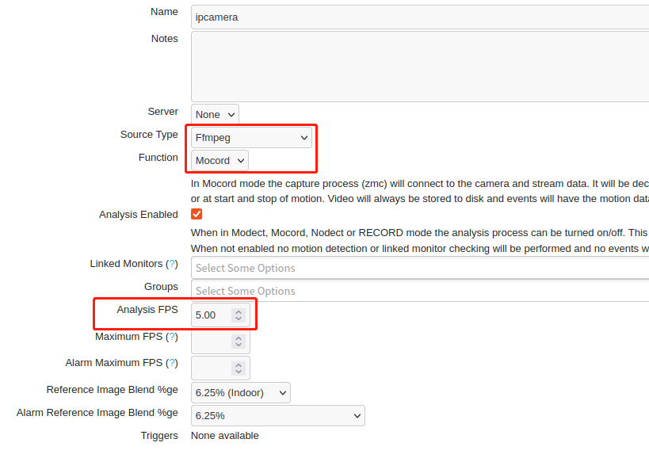
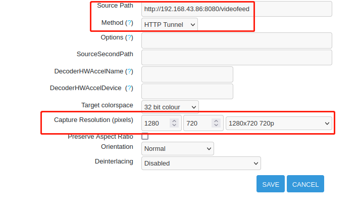

# ZoneMinder

## 1. 启动

```shell
sudo systemctl start zoneminder
sudo systemctl restart docker
```

## 2. 默认账号密码

```shell
admin/admin
```

## 3. 设置手机作为ip摄像头





## 3. 设置中文

### 3.1. 无效

```shell
# 下载字体-文泉驿微米黑
sudo apt-get install fonts-wqy-microhei

# 修改 ZoneMinder 配置文件 在 zm.conf 文件中找到 ZM_OPT_LANG 行，并将其值设置为 zh_CN.UTF-8
sudo nano /etc/zm/zm.conf
ZM_OPT_LANG=zh_CN.UTF-8

# 重新启动 Apache 服务
sudo service apache2 restart
```

### 3.2. 系统System->LANG设置为zh-cn